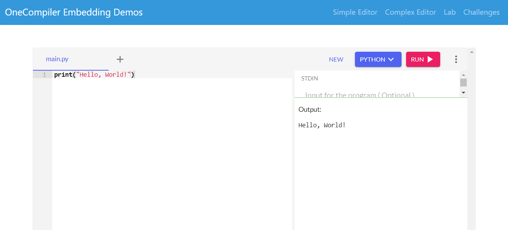
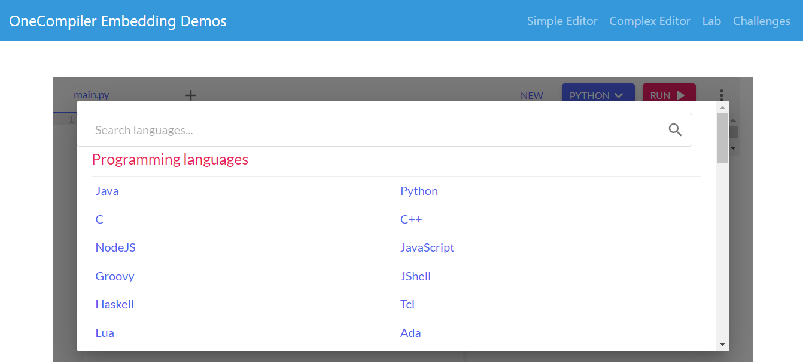
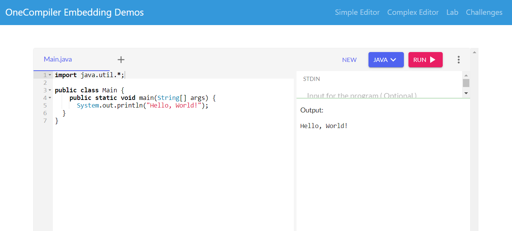
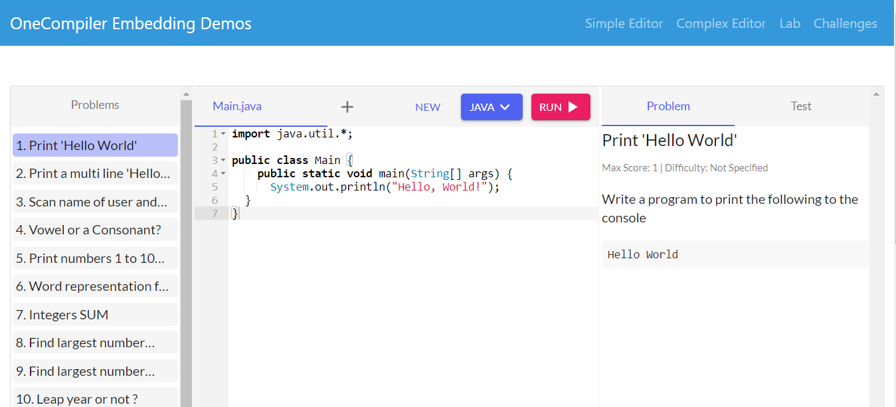
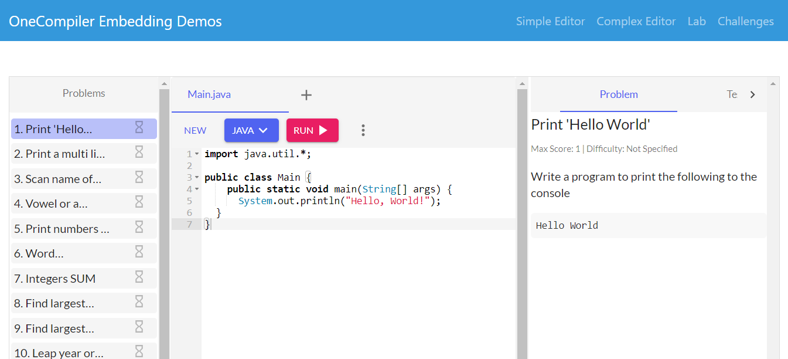

# EDITOR EMBED 
👨‍🏫ESSE APP UTILIZA O SERVIÇO DO ONECOMPILER, QUE É UMA PLATAFORMA ONLINE PARA EXECUÇÃO DE CÓDIGO.

  
  
  
  
  

## DESCRIÇÃO:
Este aplicativo de editor embed permite integrar funcionalidades interativas de programação em sites através de iframes. 

Cada demo utiliza o Bootstrap para uma aparência responsiva e amigável para dispositivos móveis, garantindo uma experiência consistente para os usuários. As integrações são feitas através de iframes que carregam conteúdo dinâmico do OneCompiler, proporcionando uma experiência de programação interativa e educacional diretamente nos sites hospedeiros.

## FUNCIONALIDADES:
1. **Simple Editor:**
   - Uma página simples que incorpora um editor para linguagem Python usando OneCompiler.
   - Permite aos usuários escrever e executar código Python diretamente na página.
   - Interface minimalista com um único iframe que suporta interações de código.

2. **Complex Editor:**
   - Demonstração de um editor mais complexo que também captura mudanças no código-fonte da página pai.
   - Inclui uma caixa de texto onde o código pode ser digitado e enviado para o editor dentro do iframe.
   - Botões para disparar a execução do código e enviar o código para o editor.

3. **Lab Demo:**
   - Uma demonstração de laboratório que incorpora um desafio de codificação para iniciantes usando OneCompiler.
   - Oferece um ambiente interativo onde os usuários podem resolver desafios de codificação diretamente no site.
   - Interface limpa com um iframe grande que contém o desafio e as opções interativas.

4. **Challenges Demo:**
   - Apresenta um desafio de codificação incorporado usando o OneCompiler.
   - Interface limpa com navegação na barra lateral para outros demos e desafios relacionados.
   - Permite aos usuários visualizar e interagir com o desafio de codificação diretamente no site.

## API ONECOMPILER:
Esse app utiliza o serviço do [OneCompiler](https://onecompiler.com/studio), que é uma plataforma online para execução de código. Aqui está como funciona:

1. **OneCompiler:**
   - O OneCompiler fornece uma API que permite incorporar editores de código em páginas da web.
   - Quando você digita um código no editor e clica para executar, o código é enviado para o serviço do OneCompiler através da API.
   - O OneCompiler executa o código no servidor e retorna o resultado (saída do programa) para ser exibido no navegador.
   - Isso permite que você execute códigos em várias linguagens de programação diretamente no seu navegador, sem precisar instalar nada localmente.

2. **Funcionamento do Demo:**
   - Cada demo utiliza um iframe para incorporar o editor de código do OneCompiler em uma página web.
   - Os demos "Simple Editor", "Complex Editor", "Lab Demo" e "Challenges Demo" todos se comunicam com a API do OneCompiler para execução dos códigos Python ou de outras linguagens suportadas.
   - A interação com botões como "Trigger Run" ou "Send Code to Editor" envia requisições para a API do OneCompiler, que processa o código e retorna os resultados conforme necessário.

3. **Integração e Personalização:**
   - Os demos são configurados para personalizar a experiência de usuário ao incorporar os editores de código do OneCompiler.
   - Isso inclui a capacidade de enviar código para o editor, ouvir eventos de código e manipular interações dentro do iframe, como visto nos exemplos de "Complex Editor" e "Lab Demo".

Assim, o OneCompiler facilita a execução de códigos em um ambiente seguro e controlado através de uma API acessível para desenvolvedores e educadores integrarem em seus próprios aplicativos web.

## EXECUTANDO O PROJETO:
1. **Simple Editor:**
   - Abra a página "Simple Editor" clicando no link correspondente na barra de navegação.
   - Um editor de código será carregado dentro de um iframe.
   - Digite seu código diretamente no editor.
   - Clique no botão de execução dentro do editor para rodar o código e ver o resultado.

2. **Complex Editor:**
   - Vá para a página "Complex Editor" através do link na barra de navegação.
   - Além do editor de código, haverá uma caixa de texto abaixo do iframe.
   - Digite ou cole seu código nesta caixa de texto.
   - Clique no botão "Send Code to Editor" para enviar o código para o editor dentro do iframe.
   - Use o botão "Trigger Run" para executar o código e ver o resultado.

3. **Lab Demo:**
   - Acesse a página "Lab Demo" selecionando o link correspondente na barra de navegação.
   - Um desafio de codificação será carregado dentro de um iframe.
   - Leia o enunciado do desafio e use o editor dentro do iframe para resolver o problema proposto.
   - Após escrever seu código, execute-o e verifique se atende aos requisitos do desafio.

4. **Challenges Demo:**
   - Entre na página "Challenges Demo" clicando no link na barra de navegação.
   - Um desafio de codificação será exibido dentro de um iframe.
   - Explore o desafio, que pode incluir instruções, uma área de código e opções interativas.
   - Resolva o desafio utilizando o editor de código dentro do iframe e interaja com outras opções disponíveis, se houver.

## NÃO SABE?
- Entendemos que para manipular arquivos em `HTML`, `CSS` e outras linguagens relacionadas, é necessário possuir conhecimento nessas áreas. Para auxiliar nesse aprendizado, oferecemos cursos gratuitos disponíveis:
* [CURSO DE HTML E CSS](https://github.com/VILHALVA/CURSO-DE-HTML-E-CSS)
* [CURSO DE JAVASCRIPT](https://github.com/VILHALVA/CURSO-DE-JAVASCRIPT)
* [CURSO DE BOOTSTRAP](https://github.com/VILHALVA/CURSO-DE-BOOTSTRAP)
* [CURSO DE JQUERY](https://github.com/VILHALVA/CURSO-DE-JQUERY)
* [CONFIRA MAIS CURSOS](https://github.com/VILHALVA?tab=repositories&q=+topic:CURSO)

## CREDITOS:
- [PROJETO CRIADO PELO "onecompiler"](https://github.com/onecompiler/editor-embed-demo)
- [PROJETO EDITADO PELO VILHALVA](https://github.com/VILHALVA)

